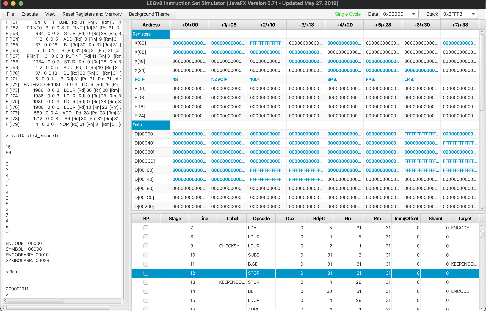

# Shannon-Fano-Encoder
### LEGv8 Assembly
---

**Abstract:**

In this project, we are given an array of symbols with corresponding frequencies(i.e.rate of occurrence). The symbol array is already sorted by the frequencies in ascending order. This program builds a binary tree using the Shannon-Fano strategy and uses the binary tree to encode a string consisting of these symbols. The binary tree generates an instantaneous and uniquely decodable code word for each symbol. Coded in LEGv8

**Navigation:**

The .s file is the assembly source code for the encoder, and the text file is an example input for the encoder. For the given text file, the output is 000001011. Attached below is the compiler output:

